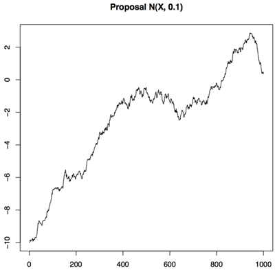
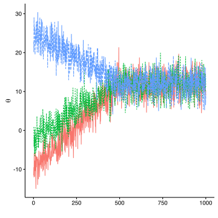
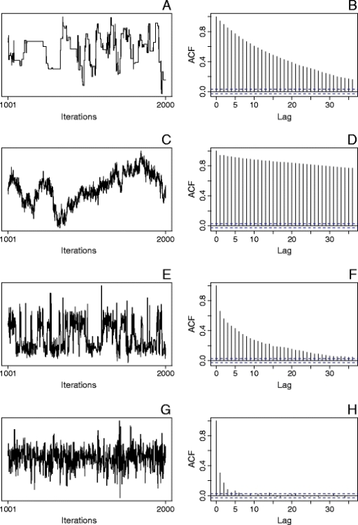

```{r setup, include=FALSE}
knitr::opts_chunk$set(echo = TRUE, fig.align='center', 
                      fig.width = 4, fig.height = 3,
                      message = FALSE, cache = TRUE)
```

## Overview

<h1>

- Modelling vs inference
- Who is Stan?
- The structure of a Stan program
- Model checking & diagnostics

</h1>


### Slides:

[kieranrcampbell.github.io/stan-workshop](https://kieranrcampbell.github.io/stan-workshop)


## Brief Recap

- Bayesian Statistics operates under a fundamentally different paradigm to classical (Frequentist) Statistics
- Frequentist probability of an event occuring is given by the relative frequency in an infinite number of experiments
- Frequentists have difficulty answering questions where experiments cannot be done, e.g. ``What is the probability that the world will end tomorrow?" 
- Bayesian probability operates on a subjective belief basis: everything can be assigned a probability
- That probability or belief might be personal to you
- Is it a better paradigm? For many problems it is more flexible but certain types of ``M-open" problems (e.g. hypothesis testing) are trickier to handle. This is because Bayesian Statistics requires us to define the entire model space.

The posterior distribution of $\theta$ given $X$ is given by:

$$
  p(\theta|X) = \frac{ p(X|\theta) p(\theta) }{ p(X) }
$$

The likelihood is the probability of seeing the data given a model and its parameters

The prior is your personal belief of what the distribution of those parameters look like (before seeing data)

The posterior is the probability distribution of those parameters (after seeing data)

## Modelling vs inference

### Modelling

- Think up mechanistic description of how the world works...
- Consider measurement error and noise
- Write down $p(\theta | X) \propto p(X|\theta)p(\theta)$
- Iterate and profit


### Inference

- Traditionally complicated, error prone, can take months
- Intellectually interesting...
- ...but fundamentally says nothing about $\theta$
- Worse, inference often affects modelling!


## Hello, Stan!

<center>

</center>

Stan is a _program_ (named after Stanislaw Ulam) to perform Bayesian inference using Hamiltonian Monte Carlo (HMC)

$\rightarrow$ let's you focus on modelling and not worry (too much!) about inference

## Stan

Building blocks of a Stan file:

### Data

What is the (fixed) data required?

### Parameters
What (uknown) parameters will we infer?

### Model

How do the parameters and data relate? Specified with probability density / mass functions

Can also have `transformed data`, `transformed parameters` and `generated quantites`

## Example: linear regression


```{r make-synthetic, message = FALSE}
library(ggplot2)

N <- 100
x <- runif(N)
y <- -1 + 3 * x + rnorm(N, 0, 0.2)
qplot(x, y)
```

## Linear regression

Linear models:

$$
y_i = \beta_0 + \beta_1 x_i + \epsilon_i, 
$$

Noise has zero mean and uncorrelated with $x_i$ (homoskedastic):

$$
\epsilon_i \sim N(0, \tau^{-1})
$$

Bayesian prior structure:

$$
\beta_0, \beta_1 \sim N(0, \sigma^2_0)
$$
$$
\tau \sim \text{Gamma}(a, b)
$$

_Remember_:
<center>
$$ \tau = \frac{1}{\sigma^2}$$
</center>

## Linear regression: priors

Let's (pretend?) we don't know much:

$$
\beta_0, \beta_1 \sim N(0, 100^2)
$$

```{r beta_prior}
qplot(rnorm(1000, 0, 100))
```

## Linear regression: priors (cont)

$$
\tau \sim \text{Gamma}(0.01, 0.01)
$$

```{r tau_prior}
qplot(rgamma(1000, 0.1, 0.1)) 
```

Beware Gamma distribution parametrisation (shape-rate-scale)

## Linear regression in Stan

Two steps

### 1. Write the model file

What data we require, and how our model relates this data to the unknown parameters (and how the parameters related to each other)

### 2. Inference

Stan _does this for you_, but we still have various decisions to make: e.g. HMC vs SVI, how many iterations, etc

## Constructing the model file: data

Model file part 1: what data do we require?

```{model-part, eval = FALSE}
data {
  int<lower = 0> N;
  real y[N];
  real x[N];
}
```

Many different data types:

* `vector`
* `cov_mat`

etc

## Constructing the model file: parameters

Model file part 2: what parameters do we have?

$$ y_i = \beta_0 + \beta_1 x_i + \epsilon_i, \;\;\epsilon_i \sim \text{Normal}(0, \tau^{-1})$$

Want to infer $\beta_0$, $\beta_1$ and $\tau$:

```{parameterpart, eval = FALSE}
parameters {
  real beta0;
  real beta1;
  real<lower = 0> tau;
}
```

Remember in Bayesian inference _there's no real difference between data and parameters!_ 

So (almost) every statement in the data block is valid here too

## Constructing the model file: model

Model file part 3: how do the parameters relate to the data?

$$ \tau \sim \text{Gamma}(a, b) \\
\beta_0, \beta_1 \sim N(0, \sigma^2_0) \\
 \epsilon_i \sim \text{Normal}(0, \tau^{-1}) \\
y_i = \beta_0 + \beta_1 x_i + \epsilon_i$$

This is encoded in Stan via:

```{modelpart, eval = FALSE}
model {
  beta0 ~ normal(0, 100);
  beta1 ~ normal(0, 100);
  tau ~ gamma(0.1, 0.1);
  for(i in 1:N) {
    y[i] ~ normal(beta0 + beta1 * x[i], 1 / sqrt(tau));
  }
}
```

## Constructing the model file: model

```{modelpart2, eval = FALSE}
model {
  beta0 ~ normal(0, 100);
  beta1 ~ normal(0, 100);
  tau ~ gamma(0.1, 0.1);
  for(i in 1:N) {
    y[i] ~ normal(beta0 + beta1 * x[i], 1 / sqrt(tau));
  }
}
```

General form: 

```{randvarexample, eval = FALSE}
random variable ~ distribution(more random variables)
```

This supports a wide range of distributions: 

* `normal`
* `gamma` 
* `student`
* `exponential`
* many more...

## Model file: some notes

### 1. Supports in place transformations! (& costs CY money)

```{example3, eval = FALSE}
1 / tau ~ inv_gamma(...);
```

### 2. Iteration with `for` loops as per `R`

```{iterexample, eval = FALSE}
for(g in 1:G) {
  ...
}
```

### 3. Assignment

Recently changed from `<-` to `=`. Useful for less-cluttered code, e.g.

```{onthefly, eval = FALSE}
real mu[N];
for(i in 1:N) mu[i] = beta0 + beta1 * x[i];
y[i] ~ normal(mu[i], 1 / sqrt(tau));
```


## Complete model
```{r lin-reg-stan-model}
model_str <- '
data {
  int<lower = 0> N;
  real y[N];
  real x[N];
}
parameters {
  real beta0;
  real beta1;
  real<lower = 0> tau;
}
model {
  beta0 ~ normal(0, 100);
  beta1 ~ normal(0, 100);
  tau ~ gamma(0.1, 0.1);
  for(i in 1:N) {
    y[i] ~ normal(beta0 + beta1 * x[i], 1 / sqrt(tau));
  }
}
'
```


## Part 2: Inference!

### Step 1: compile the Stan model

```{r stan-model, include = FALSE}
library(rstan)
linear_model <- stan_model(model_code = model_str)
```

```{r stan-model-display, eval = FALSE}
library(rstan)
linear_model <- stan_model(model_code = model_str)
```

For simple models it's easy to pass the model specification as a string. For more complex models, it's better to store it as a separate file:

```{r stan-model-from-file, eval = FALSE}
complex_model <- stan_model("my_complex_model.stan")
```

## Part 2: Inference!

### Step 2: run the model

Put data into list format:

```{r data-to-list}
data_list <- list(x = x, y = y)
```

Inference using `sampling`:

```{r stan-inference}
fit <- sampling(linear_model,
                data = data_list, 
                iter = 4000, # Number of MCMC iterations
                warmup = 2000, # How many iterations at beginning to ignore
                chains = 4,  # Number of chains to sample
                thin = 4) # Only keep every fourth sample
```

## Inference (cont)

What does `sampling` return?

```{r whatret}
str(fit, max.level = 2)
```

## Inference (cont)

How do you extract parameter estimates? Use `extract`!

For $\beta_0$:

```{r beta0}
beta0_trace <- rstan::extract(fit, "beta0")$beta0
str(beta0_trace)
```

Can get a posterior mean estimate using `mean` (multidimensional parameter -> `colMeans`):

```{r beta0map}
beta0_map <- mean(beta0_trace)
beta0_map
```

## Inference (cont)

How does this compare to the _truth_?

```{r beta0-truth}
qplot(beta0_trace, geom = 'density') +
  geom_vline(xintercept = -1, colour = 'darkblue') +
  geom_vline(xintercept = beta0_map, colour = 'darkred')
```

## MCMC diagnostics

But we normally (never) know the truth...

...so examine MCMC diagnostics

Issues with MCMC samplers:

1. Not enough iterations -> unrepresentative of target distribution
2. Correlated draws -> less precise than independent

<div class = "red2">
<center>
Love MCMC diagnostics? BDA3 11.4
</center>
</div>


## Practical MCMC diagnostics
, in particular:

- Traces of log-likelihood and parameters
- Autocorrelation plots
- Effective sample size
- Monte Carlo standard error
- Gelman's R-hat

## Diagnostics: trace examination

<div class="columns-2">
  Bad: <br/>
  

  Good:
  
  
  
</div>

<div class="centered">
<font size="2">

- http://jacobcvt12.github.io/2016/parallel-diagnostics.html
- http://matstrand.com/guides/MCMC/

</font>
</div>

## Diagnostics: trace examination

```{r ll, fig.width = 7, fig.height = 3}
stan_trace(fit, "lp__")
```

## Diagnostics: trace examination

Bad convergence:

```{r bad-convergence, echo = FALSE, fig.width = 7, fig.height = 3}
library(tidyverse)
bad_conv <- replicate(4, cumsum(rnorm(1000)))
as_data_frame(bad_conv) %>% mutate(iter = 1:1000) %>% 
  gather(chain, lp__, -iter) %>% 
  arrange(iter) %>% 
  ggplot(aes(x = iter, y = lp__, color = chain)) + geom_line() +
  cowplot::theme_cowplot() + ylab("log-posterior") +
  theme(axis.title.x = element_blank())
```

## Diagnostics: trace examination

```{r stan-trace-pars, fig.width = 7, fig.height = 3}
stan_trace(fit, pars = c("beta0", "beta1", "tau"))
```

## Diagnostics: autocorrelation

How correlated is each draw with a given lag along the Markov chain?

<div class="centered">



<font size="2">
WoMMBAT: A user interface for hierarchical Bayesian estimation of working memory capacity.
</font>
</div>

## Diagnostics: autocorrelation

```{r stan-autocor, fig.width = 3, fig.height = 3}
stan_ac(fit, "lp__")
```

## Diagnostics: autocorrelation

```{r stan-autocor-2, fig.width = 6, fig.height = 3}
stan_ac(fit)
```

## Diagnostics: MCSE

Still trying to estimate $\hat{\theta}$ from a (finite) sample
$\rightarrow$ Monte Carlo Standard Error (MCSE)

Qn: how does the MCSE compare to the posterior variances?

```{r stan-mcse, fig.width = 3, fig.height = 3}
stan_mcse(fit)
```


## Diagnostics: ESS

Given the draws aren't truly independent, what is the effective sample size (ESS)? (one for each parameter)

```{r stan-ess}
stan_ess(fit)
```


## Diagnostics: Gelman-Rubin R-hat

Ratio if within-to-between sample variance

```{r stan-rhat}
stan_rhat(fit)
```

If $\hat{R}$ is far from 1, more iterations may help


## Discrete parameters

Stan can't do inference over discrete parameters (because can't compute gradient). However, in many cases we can marginalise them out:

If $\theta$ is a continuous parameter and $\phi$ is discrete, normally target unnormalised density $p(x | \theta, \phi)p(\theta)p(\phi)$. Instead, target

$$
p(x | \theta)p(\theta) = \sum_{k \in \Omega(\phi)}
p(x | \theta, \phi = k)p(\theta)p(\phi = k)
$$

### Messing with the log-likelihood directly

Using `target += ` to manipulate the log-likelihood:

```{targetmess, eval = FALSE}
y[i] ~ normal(mu[i], 1 / sqrt(tau))
```

is entirely equivalent to

```{targetmesss, eval = FALSE}
target += normal(y[i] | mu[i], 1 / sqrt(tau))
```

The `|` is a recent syntax change to Stan.

## Discrete parameters

Example: finite mixture model

The responsibility parameters (data sample $i$ belongs to cluster $k$ are discrete).

```{discretemixexample, eval = FALSE}
 parameters {
      real y;
} model {
      target += log_sum_exp(log(0.3) + normal(y | -1, 2),
                            log(0.7) + normal(y | 3 1));
}
```

Life pro tip: use `log_sum_exp` wherever possible (and work with log probability densities).

## Stochastic Variational Inference

```{r vb}
fit_vb <- vb(linear_model, data = data_list)
```

## SVI (cont)

```{r beta0vb}
beta0_trace_vb <- rstan::extract(fit_vb, "beta0")$beta0
beta0_map_vb <- mean(beta0_trace_vb)

qplot(beta0_trace_vb, geom = 'density') +
  geom_vline(xintercept = -1, colour = 'darkblue') +
  geom_vline(xintercept = beta0_map_vb, colour = 'darkred')
```


## Resources

- Bayesian Data Analysis 3
- [mc-stan.org](https://mc-stan.org)
- [Loo](http://mc-stan.org/interfaces/loo.html) leave one out cross-validation
- [Rstanarm](http://mc-stan.org/interfaces/rstanarm.html) applied regression modelling


